最近在玩 [ShaderGPT](https://shadergpt.14islands.com/)——瑞典/冰岛创意机构 **14islands** 做的一个工具：你用一句自然语言描述想要的画面（比如 "organic motion background"），它就吐出一段完整的 **GLSL 片段着色器**，并在右侧实时 WebGL 预览。这篇文章是我对它的一次认真测评：不是凭感觉打分，而是**真实采集 + 本地实测取证**。

<!--more-->

## 怎么测的：真实采集 + 本地复现

ShaderGPT 每天只有 14 次免费额度，硬刷不划算。所以我换了个思路：

1. **采集真实社区案例。** 它的探索页（约 2716 页、2400+ 个作品）是 Next.js 的 SPA，数据藏在 RSC flight payload 里。我把多页数据拉下来解析，拿到了 **138 个真实案例**——每条都带原始 prompt、所用模型、点赞数、温度参数和完整 GLSL 代码。
2. **本地实测渲染。** 对其中 **20 个含完整代码**的案例，我用 headless Chrome + WebGL 在本地逐个**编译并截图**，作为视觉证据。

这里有个重要发现：ShaderGPT 的产物运行在 **Three.js** 环境里，代码尾部普遍带 `#include <colorspace_fragment>`、甚至 glslify 宏，**在裸 WebGL 下直接编译会报错**。我把这些环境相关的宏剥离后，20 个全部编译通过、其中 18 个成功渲染出有效画面。也就是说——**它的产物和 Three.js 运行时强耦合，并不是"即拷即用"的标准 GLSL**。这点对想把代码搬到其他引擎的人很关键。

## 七个维度怎么打分

我按七个维度归类，每个维度从 **生成质量 / 理解准确度 / 可运行性** 三项打分（1–5）：

| 维度 | 生成质量 | 理解准确度 | 可运行性 | 均分 |
|---|:--:|:--:|:--:|:--:|
| D1 几何图形生成 | 3.5 | 4.0 | 4.5 | 4.0 |
| D2 光影渲染 | 3.0 | 3.5 | 4.5 | 3.7 |
| D3 动画与交互 | 4.0 | 4.5 | 4.5 | 4.3 |
| D4 纹理与噪声 | 4.5 | 4.5 | 4.5 | 4.5 |
| D5 后处理效果 | 3.5 | 3.5 | 4.0 | 3.7 |
| D6 自然现象模拟 | 4.0 | 4.0 | 4.5 | 4.2 |
| D7 抽象/艺术风格 | 4.5 | 4.0 | 4.0 | 4.2 |

简单说：

- **最强 —— 纹理/噪声（D4）和动画交互（D3）。** Simplex/fbm/IQ 调色板、`u_time` + `u_mouse` 交互几乎"开箱即得"，代码规范到能当教学范本，编译零报错。
- **最出彩 —— 艺术风格（D7）。** 梦境星云、霓虹、psychedelic 占了探索页半壁江山；连中文复杂叙事 prompt（下面 s16「紫色峡谷巨眼」）也能落地成有氛围的画面。
- **最弱 —— 精确几何（D1）和真实光照（D2）。** 抽象/简短 prompt 容易被"美化"：比如 `sdf of a sphere` 实际渲染成了螺旋纹理（s06），好看但偏离了原意。

## 20 例本地实测渲染总览

下面这张是 20 个案例在本地 WebGL（800×600，固定时间帧）渲染的真实截图拼图：

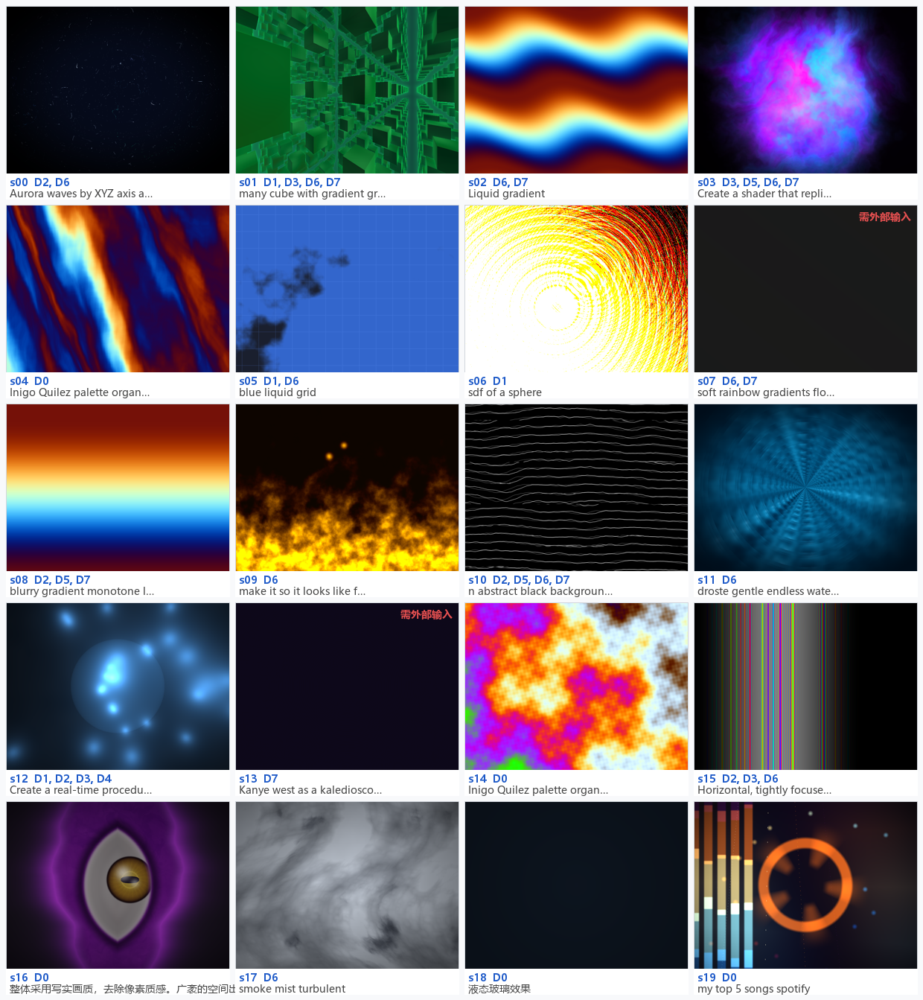

接下来逐一展开。**每条 prompt 都以中英双语完整呈现，不做任何省略或截断**——包括两条原文为中文的（s16、s18，附英文翻译）。

  

    
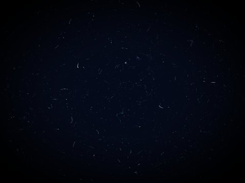

    

      
s00 光影、自然现象

      
ENAurora waves by XYZ axis and covered by fluted frosted glass

      
中沿 XYZ 轴流动的极光波纹，并覆盖一层带凹槽纹理的磨砂玻璃

      
claude-sonnet-3.7 · ♥ 12 · temp 0.1 · ✓ 渲染成功

    

  

  

    
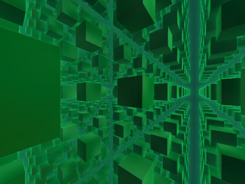

    

      
s01 几何、动画交互、自然现象、抽象艺术

      
ENmany cube with gradient green. liquid cursor effect.

      
中许多带绿色渐变的立方体，配合液态光标跟随效果

      
claude-sonnet-3.7 · ♥ 4 · temp 1 · ✓ 渲染成功

    

  

  

    
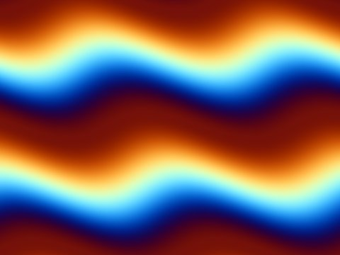

    

      
s02 自然现象、抽象艺术

      
ENLiquid gradient

      
中液态渐变

      
deepseek-v3 · ♥ 4 · temp 0.3 · ✓ 渲染成功

    

  

  

    
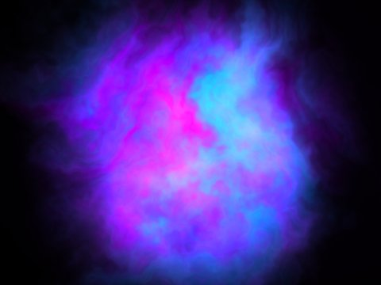

    

      
s03 动画交互、后处理、自然现象、抽象艺术

      
ENCreate a shader that replicates the iPhone Siri animation interface. The animation should feature a fluid, ethereal purple and blue gradient. The effect should have a soft, pulsing glow that creates depth, with smooth transitions between colors. The animation needs a translucent, liquid-like quality with subtle movement throughout. Use predominantly purple and blue hues that shift and blend naturally. The edges should be soft with a bloom effect to create a glowing appearance. Incorporate subtle fluid dynamics to make the animation feel organic and responsive, as if it's reacting to sound input. The overall aesthetic should be sleek and modern, matching Apple's minimalist design language

      
中创建一个复刻 iPhone Siri 动画界面的着色器。动画应呈现流动、空灵的紫蓝渐变；效果要带有柔和的脉动辉光以营造纵深感，颜色之间平滑过渡。动画需要半透明、类液态的质感，整体伴随细微的运动。以紫色和蓝色色调为主，自然地位移与融合。边缘应柔和并带泛光（bloom）效果以产生发光外观。融入细微的流体动力学，让动画显得有机且具响应性，仿佛在对声音输入做出反应。整体美学应简洁现代，契合苹果的极简设计语言。

      
claude-sonnet-3.7 · ♥ 3 · temp 0 · ✓ 渲染成功

    

  

  

    
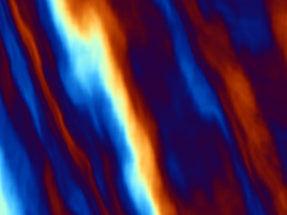

    

      
s04 未分类

      
ENInigo Quilez palette organic background

      
中使用 Inigo Quilez 调色板的有机感背景

      
claude-sonnet-3.5 · ♥ 2 · temp 0.5 · ✓ 渲染成功

    

  

  

    
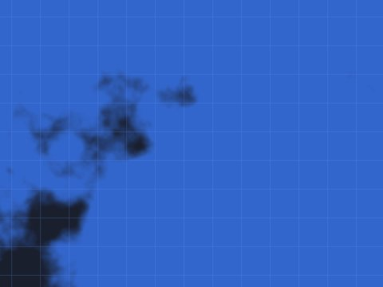

    

      
s05 几何、自然现象

      
ENblue liquid grid

      
中蓝色液态网格

      
claude-sonnet-3.5 · ♥ 2 · temp 0.5 · ✓ 渲染成功

    

  

  

    
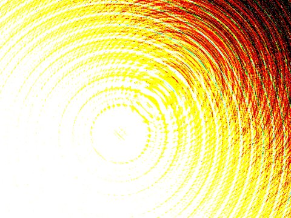

    

      
s06 几何

      
ENsdf of a sphere

      
中一个球体的 SDF（有向距离场）

      
claude-sonnet-3.7 · ♥ 2 · temp 0.5 · ✓ 渲染成功

    

  

  

    
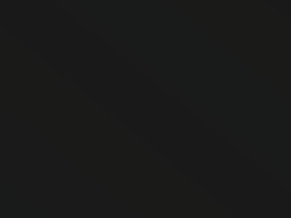

    

      
s07 自然现象、抽象艺术

      
ENsoft rainbow gradients flowing into eachother gently

      
中柔和的彩虹渐变，彼此轻柔地相互流入交融

      
deepseek-v3 · ♥ 2 · temp 0.5 · ⚠ 需站点外部输入

    

  

  

    
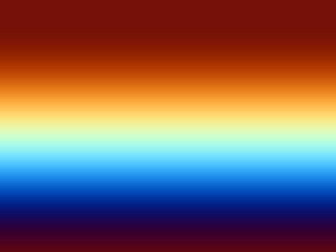

    

      
s08 光影、后处理、抽象艺术

      
ENblurry gradient monotone light gradient, inspired by the stripe app

      
中模糊的单色调浅色渐变，灵感来自 Stripe 应用

      
deepseek-v3 · ♥ 2 · temp 0.3 · ✓ 渲染成功

    

  

  

    
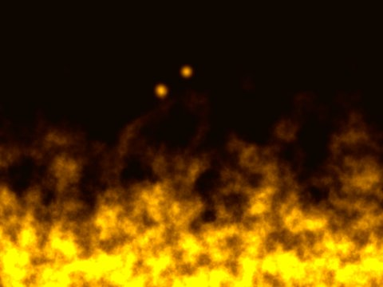

    

      
s09 自然现象

      
ENmake it so it looks like flames more

      
中让它看起来更像火焰一些

      
claude-sonnet-3.7 · ♥ 2 · temp 0.5 · ✓ 渲染成功

    

  

  

    
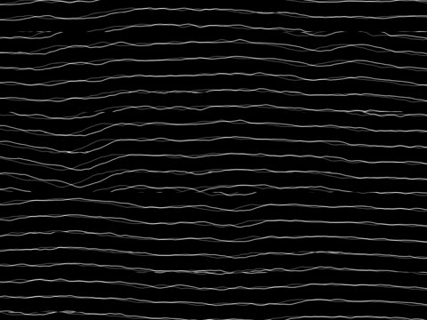

    

      
s10 光影、后处理、自然现象、抽象艺术

      
ENn abstract black background with thin, evenly spaced white wavy lines running from top to bottom. The lines flow smoothly, creating an elegant wave-like pattern with subtle variations in curvature. The overall composition maintains a sense of symmetry but includes slight distortions that add an organic, fluid movement. The contrast between the deep black background and the crisp white lines enhances the sense of depth and sophistication

      
中一个抽象的黑色背景，上面有从上到下、纤细且均匀间隔的白色波浪线。线条平滑流动，形成优雅的波浪状图案，曲率有细微变化。整体构图保持对称感，但包含轻微的扭曲，增添有机、流动的动感。深黑背景与清晰白线之间的对比强化了纵深感与精致感。

      
claude-sonnet-3.7 · ♥ 2 · temp 0.5 · ✓ 渲染成功

    

  

  

    
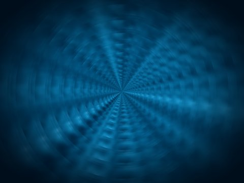

    

      
s11 自然现象

      
ENdroste gentle endless water

      
中德罗斯特效应（Droste）般柔和、无尽延伸的水面

      
claude-sonnet-3.7 · ♥ 1 · temp 0 · ✓ 渲染成功

    

  

  

    
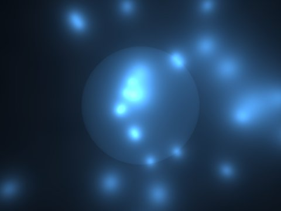

    

      
s12 几何、光影、动画交互、纹理噪声

      
ENCreate a real-time procedural shader that renders a sphere filled with dynamic procedural particles. The particles inside the sphere should move based on real-time physics and interact with each other using collision detection. Additionally, they should collide with the inner walls of the sphere. Outside the sphere, generate real-time procedural particles that are attracted to the sphere using attraction physics. These external particles should orbit and dynamically react to the sphere's movement. Enable user interaction: when the mouse moves, the sphere should respond by slightly shifting its position, causing both the internal and external particles to react accordingly. Ensure the system runs efficiently with optimized GPU computations for smooth real-time performance.

      
中创建一个实时程序化着色器，渲染一个内部充满动态程序化粒子的球体。球内粒子应基于实时物理运动，并通过碰撞检测相互作用；此外它们还应与球体内壁发生碰撞。在球体外部，生成被球体吸引的实时程序化粒子，这些外部粒子应使用引力物理进行环绕，并对球体的运动做出动态反应。启用用户交互：当鼠标移动时，球体应通过轻微位移做出响应，从而带动内部与外部粒子相应反应。请确保系统通过优化的 GPU 计算高效运行，以获得流畅的实时性能。

      
claude-sonnet-3.7 · ♥ 1 · temp 0.5 · ✓ 渲染成功

    

  

  

    
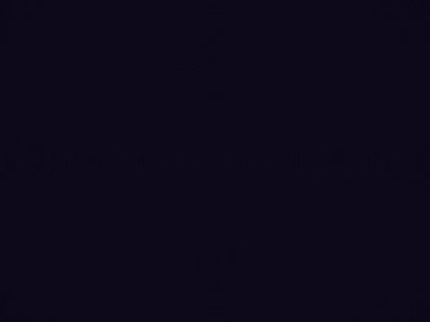

    

      
s13 抽象艺术

      
ENKanye west as a kaledioscope

      
中把 Kanye West（坎耶·维斯特）做成万花筒效果

      
claude-sonnet-3.7 · ♥ 1 · temp 0.5 · ⚠ 需站点外部输入

    

  

  

    
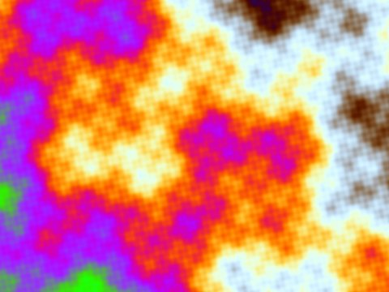

    

      
s14 未分类

      
ENInigo Quilez palette organic background

      
中使用 Inigo Quilez 调色板的有机感背景

      
chatgpt-4o-latest · ♥ 1 · temp 0.5 · ✓ 渲染成功

    

  

  

    
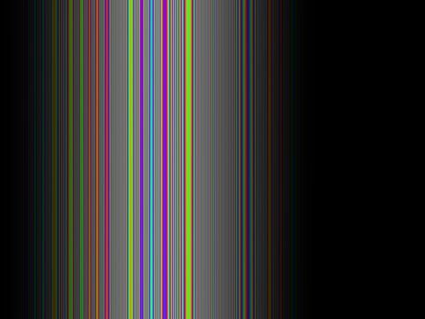

    

      
s15 光影、动画交互、自然现象

      
ENHorizontal, tightly focused in center of transparent background reactive to sound soundwaves vector visible light spectrum

      
中水平方向、紧凑聚焦于透明背景中心，对声音做出反应的声波，矢量化的可见光光谱

      
deepseek-v3 · ♥ 1 · temp 0.2 · ✓ 渲染成功

    

  

  

    
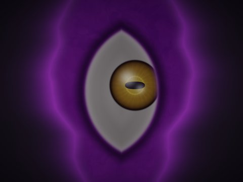

    

      
s16 未分类

      
ENUse a photorealistic rendering quality, removing any pixelated texture. In a vast space appears a tear/rift as deep and wide as a giant canyon; the canyon-shaped fissure itself serves as an eye socket, and along its inner walls churns thick, flowing purple cosmic mist, with shattered wisps of purple vapor spreading outward along the canyon edges, reinforcing the sense of space being forcibly torn open. At the very center of the canyon is embedded one enormous, clearly and completely formed vertical giant eye, with well-defined structure, layered iris detail, and a horizontally elongated narrow pupil, in strong contrast, making it a highly prominent visual subject. The overall background is a pure deep gray, with no trees, buildings, sky or other extraneous elements; all visual focus is on the canyon fissure and the giant eye. Add dynamic interaction: this giant eye rotates in real time to follow the mouse position, its gaze always locked onto the cursor. The overall lighting is concentrated on the giant eye and the purple canyon fissure, with distinct light-and-dark layering, an oppressive and eerie atmosphere, retaining only the spatial canyon rift, the purple mist, and the giant horizontal-pupil eyeball.

      
中整体采用写实画质，去除像素质感。广袤的空间出现一道如同巨型峡谷一样深邃宽大的撕裂缺口，峡谷形态的裂隙直接充当眼眶，裂隙内壁翻涌着浓稠、流动的紫色空间云雾，破碎散开的紫色气雾沿着峡谷边缘向外蔓延，强化空间被强行撕开的破碎感。峡谷正中央镶嵌着一只体量巨大、形态清晰完整的竖型巨眼，眼睛结构明确，虹膜层次清晰，瞳孔是横向狭长的样式，对比强烈，视觉主体十分突出。整体背景为纯净深灰色，不存在树木、建筑、天空景物等多余元素，所有视觉焦点都集中在峡谷裂隙与巨眼上。增加动态交互设定，这只巨型眼睛会实时跟随鼠标的位置转动，视线始终锁定光标。整体光影集中在巨眼和紫色峡谷裂隙上，明暗层次分明，氛围压抑诡秘，只保留空间峡谷裂痕、紫色云雾以及巨型横瞳眼球。

      
anthropic/claude-opus-4.6 · ♥ 0 · temp 0.5 · ✓ 渲染成功

    

  

  

    
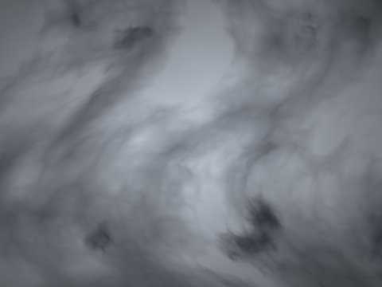

    

      
s17 自然现象

      
ENsmoke mist turbulent

      
中湍流翻涌的烟雾与薄雾

      
anthropic/claude-sonnet-4.5 · ♥ 0 · temp 0.5 · ✓ 渲染成功

    

  

  

    
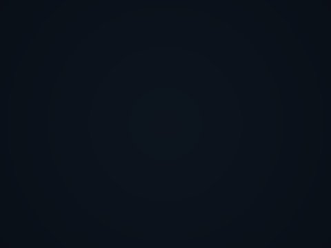

    

      
s18 未分类

      
ENLiquid glass effect

      
中液态玻璃效果

      
anthropic/claude-sonnet-4.5 · ♥ 0 · temp 0.5 · ✓ 渲染成功

    

  

  

    
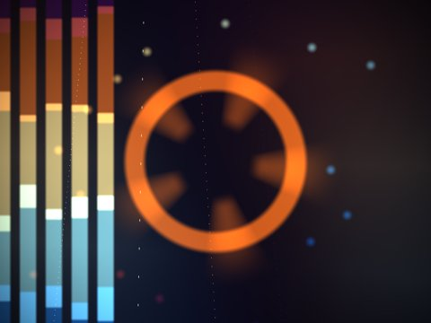

    

      
s19 未分类

      
ENmy top 5 songs spotify

      
中我在 Spotify 上最常听的五首歌（音乐可视化）

      
anthropic/claude-sonnet-4.5 · ♥ 0 · temp 0.5 · ✓ 渲染成功

    

  

## 整体结论

**一句话定位：ShaderGPT 是一台优秀的"视觉创意点子引擎"，而不是"精确图形工程工具"。** 它把 GLSL 创作的门槛从"懂数学 + 懂 GPU"降到了"会描述画面"。

- 它在**噪声/纹理、动画交互、自然现象、艺术氛围**四个维度表现突出；
- 在**精确几何、真实 PBR 光照、多 pass 后处理**三个维度，受限于"prompt 美化倾向"和"单 pass 片段着色器"这两个根本约束；
- 产物**与 Three.js 强耦合**，依赖外部图像/音频纹理的效果（万花筒 s13、音乐可视化 s19）脱离站点就无法复现。

**给同行的建议：** 如果你是设计师/前端，要做背景氛围、Hero 动效、创意原型——强烈推荐，效率极高；如果你需要精确几何、要移植到原生 GLSL 或游戏引擎、或追求真实物理——把它当成起点草稿，后面仍需人工重构并去掉 Three.js 耦合。

---

*本文数据来自 shadergpt.14islands.com/explore 的真实采集，效果图为本地 WebGL 实测渲染。评分为基于样本的主观综合评估。*
