如果让一个 AI agent 做 UE 材质，它能走多远？最低的标准是「把三张贴图（BaseColor / Normal / Roughness）连到材质输出」——这能还原一个扫描材质，但**那只是资产搬运，不是材质设计**。这篇文章是我以 Technical Artist 的视角做的一次系统评测：在「贴图直连」这条基线之上，看 agent 能否真正**设计出一套复杂材质体系**——参数化、程序化、自定义光照、动态效果、高级 BRDF，并用一套四维量化体系给它打分。

<!--more-->

> 本文的数据、配色与图表均来自配套的交互式评测看板，这里将其适配为博客排版完整呈现。

## 评测立意：一条基线，五级阶梯

「贴图直连」之所以是基线（T0），是因为它**节点数 ≈ 3、逻辑节点 0、暴露参数 0、可派生实例 1**——没有任何"设计"成分。要衡量 agent 的设计能力，我设计了一条**复杂度阶梯**，每一级对应一类 shader 能力的跃迁：

<b>T0</b> 基线·贴图直连

<b>T1</b> 参数化

<b>T2</b> 程序化

<b>T3</b> 动态/风格化

<b>T4</b> 专家·高级光照

围绕这条阶梯，我让 agent 设计了 **5 类父材质（Master Material）+ 23 个子实例（Material Instance）**，并把每个材质的节点图、暴露参数、连接关系全部结构化为 JSON，再用评分引擎自动量化。下面是总体规模：

5

父材质分类

vs 基线 1 类

23

子实例

vs 基线 1 个

151

节点总数

平均 30 / 材质

62

暴露参数

基线 0 个

91.2

套件平均总分

基线 20.0 分

## 五类父材质，对应五种 shader 范式

PBR 基础类

参数化母材质89.8
T1 参数化 A

节点 / 深度<b style="color:#fff">25 / 8</b>

暴露参数<b style="color:#fff">11</b>

着色模型<b style="color:#fff">DefaultLit</b>

程序化纹理类

数学节点生成94.3
T2 程序化 S

节点 / 深度<b style="color:#fff">33 / 11</b>

暴露参数<b style="color:#fff">12</b>

着色模型<b style="color:#fff">DefaultLit</b>

风格化渲染类

卡通色阶+描边86.8
T3 风格化 A

节点 / 深度<b style="color:#fff">27 / 9</b>

暴露参数<b style="color:#fff">11</b>

着色模型<b style="color:#fff">Unlit</b>

动态效果类

时间驱动动效96.1
T3 动态 S

节点 / 深度<b style="color:#fff">37 / 10</b>

暴露参数<b style="color:#fff">12</b>

混合模式<b style="color:#fff">Masked</b>

高级光照类

多 BRDF 封装88.8
T4 专家 A

节点 / 深度<b style="color:#fff">29 / 9</b>

暴露参数<b style="color:#fff">16</b>

着色模型<b style="color:#fff">ClearCoat</b>

每类各自考察一种核心能力：

- **PBR 基础类（T1）** — 金属-粗糙度工作流的完整参数化。亮点是 `Roughness Min/Max` 重映射（把贴图灰度 Lerp 到任意粗糙度区间）、Detail Normal 二次混合、AO 强度可调——这些正是 TA 做材质实例化的基本功。
- **程序化纹理类（T2）** — **零贴图**，纯数学生成。多倍频 FBM + Voronoi 细胞噪声混合，叠加 Sine 程序条纹，法线由图案高度的 DDX/DDY 偏导（CustomExpression）程序生成，并用 StaticSwitch 在编译期切换 UV / 世界坐标投影。
- **风格化渲染类（T3 / Unlit）** — **绕过 UE 默认 BRDF** 手动重建光照：手算 N·L → 多档 Posterize 量化成 cel-shading 硬边 → Fresnel 驱动边缘光与轮廓描边。
- **动态效果类（T3 / Masked）** — Time 节点驱动的多合一动效：溶解（切 OpacityMask + 发光边缘）、UV 扭曲、脉冲呼吸、视差、顶点波动（WPO）。
- **高级光照类（T4 / ClearCoat）** — 统一封装四种进阶 BRDF：次表面散射、各向异性（拉丝）、虹彩薄膜干涉、布料绒毛，考察对多种 ShadingModel **专有输出引脚**的掌握。

## 子实例生成：典型 / 边界 / 极端三层采样

每个父材质衍生 4–5 个子实例，**仅覆写暴露参数**，不动图结构（这正对应 UE 的 MaterialInstance 机制）。参数选取遵循三层采样，既验证常见场景，也把参数推到边界与极端，探出材质的"表达带宽"：

<table>
<tr><th>实例</th><th>采样</th><th>关键覆写</th><th>模拟材质</th></tr>
<tr><td><b>抛光黄铜</b></td><td>典型</td><td>Metallic=1.0, Roughness 0.05~0.18</td><td>高反射金属</td></tr>
<tr><td><b>做旧锈铁</b></td><td>边界</td><td>Metallic=0.6, Roughness Max=1.0</td><td>半金属做旧</td></tr>
<tr><td><b>发光面板</b></td><td>极端</td><td>Emissive Intensity=50</td><td>自发光过曝</td></tr>
<tr><td><b>翡翠玉石</b></td><td>极端</td><td>SSS Amount=1.0</td><td>次表面散射</td></tr>
<tr><td><b>拉丝钛金属</b></td><td>极端</td><td>Anisotropy=0.9</td><td>各向异性高光</td></tr>
<tr><td><b>肥皂泡虹彩</b></td><td>极端</td><td>Iridescence Bands=6</td><td>薄膜干涉</td></tr>
<tr><td><b>心跳核心</b></td><td>极端</td><td>Pulse Speed=12, Max=10</td><td>动态脉冲</td></tr>
</table>

## 23 个子实例的渲染结果索引

下面是全部 23 个子实例的代表性外观预览（依各实例参数语义程序化合成的近似渲染，用于在评测中快速比对视觉差异）。颜色标签对应五类父材质：

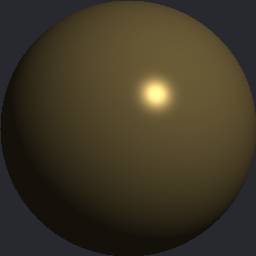

抛光黄铜典型

PBR 基础

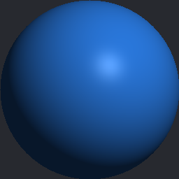

磨砂塑料典型

PBR 基础

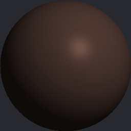

做旧锈铁边界

PBR 基础

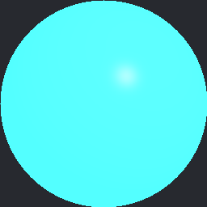

发光面板极端

PBR 基础

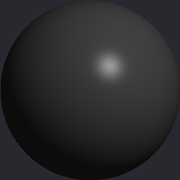

全默认灰边界

PBR 基础

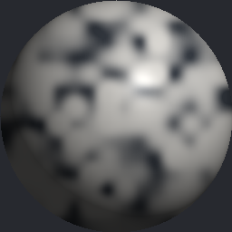

程序化大理石典型

程序化

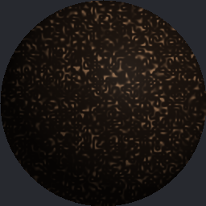

龟裂泥土典型

程序化

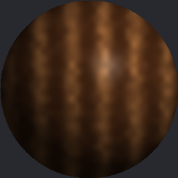

程序化木纹边界

程序化

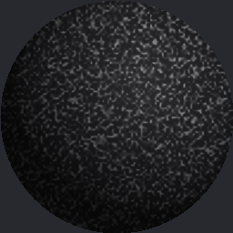

世界投影岩石极端

程序化

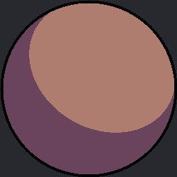

经典二档卡通典型

风格化

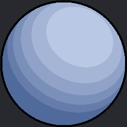

多档赛璐珞典型

风格化

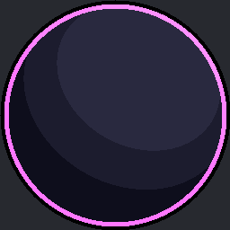

强边缘光英雄极端

风格化

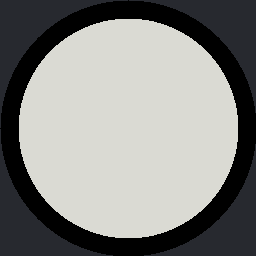

线稿描边极端

风格化

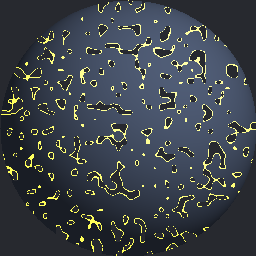

燃烧溶解典型

动态效果

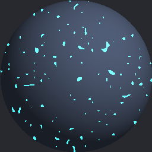

能量护盾典型

动态效果

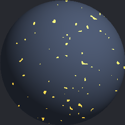

全息扰动边界

动态效果

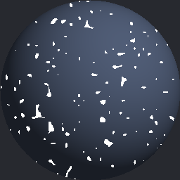

心跳核心极端

动态效果

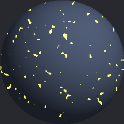

波动水面极端

动态效果

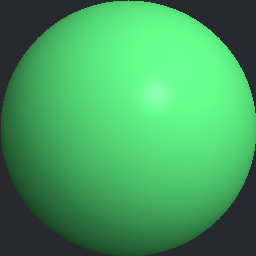

翡翠玉石极端

高级光照

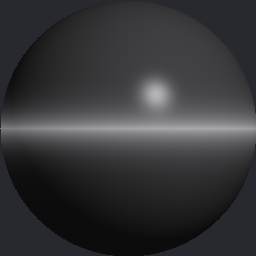

拉丝钛金属极端

高级光照

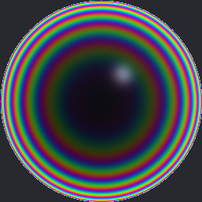

肥皂泡虹彩极端

高级光照

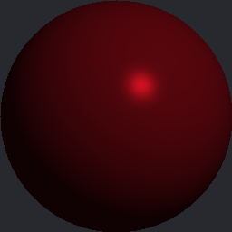

汽车金属漆典型

高级光照

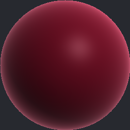

丝绒布料极端

高级光照

## 四维量化评测体系

评分引擎对每个父材质自动解析打分，四个维度各占 25%：

| 维度 | 权重 | 子项构成 |
|---|:--:|---|
| **节点复杂度** | 25% | 节点数（对数缩放）+ 最大层级深度 + 节点类型多样性 + 连边密度 |
| **参数化设计合理性** | 25% | 参数规模 + 分组组织 + 范围/UI 范围完整性 + 语义说明 + 默认值合法性 |
| **效果多样性** | 25% | 子实例数量 + 参数覆盖广度 + 采样类型熵（三类均衡=满）+ 取值离散度 |
| **技术正确性** | 25% | 连接完整性 + 数据类型匹配 + 参数绑定 + 输出引脚与 ShadingModel 一致性 − 孤立节点 |

其中**技术正确性**是 TA 视角的"硬规则"：每条连边端点必须存在、标注数据类型、参数必须真的绑定到 `*Parameter` 节点、输出引脚必须被当前 ShadingModel 支持（Unlit 不能接 Roughness、只有 ClearCoat 才有 ClearCoat 引脚）。

### 四维雷达：五类材质 vs 基线

<svg viewBox="0 0 520 430" width="100%" style="max-width:520px"><polygon points="260.0,172.5 297.5,210.0 260.0,247.5 222.5,210.0" fill="none" stroke="#2a2f3a" stroke-width="1"/><polygon points="260.0,135.0 335.0,210.0 260.0,285.0 185.0,210.0" fill="none" stroke="#2a2f3a" stroke-width="1"/><polygon points="260.0,97.5 372.5,210.0 260.0,322.5 147.5,210.0" fill="none" stroke="#2a2f3a" stroke-width="1"/><polygon points="260.0,60.0 410.0,210.0 260.0,360.0 110.0,210.0" fill="none" stroke="#2a2f3a" stroke-width="1"/><line x1="260" y1="210" x2="260.0" y2="60.0" stroke="#2a2f3a" stroke-width="1"/><text x="260.0" y="33.0" fill="#9aa3b2" font-size="13" text-anchor="middle">节点复杂度</text><line x1="260" y1="210" x2="410.0" y2="210.0" stroke="#2a2f3a" stroke-width="1"/><text x="437.0" y="210.0" fill="#9aa3b2" font-size="13" text-anchor="middle">参数化设计</text><line x1="260" y1="210" x2="260.0" y2="360.0" stroke="#2a2f3a" stroke-width="1"/><text x="260.0" y="387.0" fill="#9aa3b2" font-size="13" text-anchor="middle">效果多样性</text><line x1="260" y1="210" x2="110.0" y2="210.0" stroke="#2a2f3a" stroke-width="1"/><text x="83.0" y="210.0" fill="#9aa3b2" font-size="13" text-anchor="middle">技术正确性</text><polygon points="260.0,90.3 410.0,210.0 260.0,332.4 119.0,210.0" fill="#8b7cff22" stroke="#8b7cff" stroke-width="2"/><polygon points="260.0,67.9 399.8,210.0 260.0,354.4 110.0,210.0" fill="#ffb84d22" stroke="#ffb84d" stroke-width="2"/><polygon points="260.0,97.2 396.6,210.0 260.0,349.5 110.0,210.0" fill="#5b9dff22" stroke="#5b9dff" stroke-width="2"/><polygon points="260.0,70.3 403.6,210.0 260.0,342.8 110.0,210.0" fill="#3ddc8422" stroke="#3ddc84" stroke-width="2"/><polygon points="260.0,87.6 396.6,210.0 260.0,327.8 116.0,210.0" fill="#ff7eb622" stroke="#ff7eb6" stroke-width="2"/><polygon points="260.0,192.0 260.0,210.0 260.0,222.0 170.0,210.0" fill="#6b728011" stroke="#6b7280" stroke-width="2" stroke-dasharray="5,4"/></svg>

PBR 基础
程序化
风格化
动态效果
高级光照
基线(虚线)

### 评分明细：套件均分 91.2，碾压基线 20.0

<h3>分维度评分（按总分排序，含基线对照）</h3>
<table>
<tr><th>材质</th><th>节点复杂度</th><th>参数化设计</th><th>效果多样性</th><th>技术正确性</th><th>总分</th><th>等级</th></tr>
<tr><td><b>动态效果类</b></td><td>
<i style="width:94.7%;background:#3ddc84"></i>
94.7</td><td>
<i style="width:93.2%;background:#3ddc84"></i>
93.2</td><td>
<i style="width:96.3%;background:#3ddc84"></i>
96.3</td><td>
<i style="width:100%;background:#3ddc84"></i>
100</td><td class="n"><b style="color:#3ddc84">96.1</b></td><td>S</td></tr>
<tr><td><b>程序化纹理类</b></td><td>
<i style="width:93.1%;background:#3ddc84"></i>
93.1</td><td>
<i style="width:95.7%;background:#3ddc84"></i>
95.7</td><td>
<i style="width:88.5%;background:#3ddc84"></i>
88.5</td><td>
<i style="width:100%;background:#3ddc84"></i>
100</td><td class="n"><b style="color:#3ddc84">94.3</b></td><td>S</td></tr>
<tr><td><b>PBR 基础类</b></td><td>
<i style="width:75.2%;background:#5b9dff"></i>
75.2</td><td>
<i style="width:91.1%;background:#3ddc84"></i>
91.1</td><td>
<i style="width:93%;background:#3ddc84"></i>
93.0</td><td>
<i style="width:100%;background:#3ddc84"></i>
100</td><td class="n"><b style="color:#3ddc84">89.8</b></td><td>A</td></tr>
<tr><td><b>高级光照类</b></td><td>
<i style="width:79.8%;background:#5b9dff"></i>
79.8</td><td>
<i style="width:100%;background:#3ddc84"></i>
100</td><td>
<i style="width:81.6%;background:#5b9dff"></i>
81.6</td><td>
<i style="width:94%;background:#3ddc84"></i>
94.0</td><td class="n"><b style="color:#3ddc84">88.8</b></td><td>A</td></tr>
<tr><td><b>风格化渲染类</b></td><td>
<i style="width:81.6%;background:#5b9dff"></i>
81.6</td><td>
<i style="width:91.1%;background:#3ddc84"></i>
91.1</td><td>
<i style="width:78.5%;background:#5b9dff"></i>
78.5</td><td>
<i style="width:96%;background:#3ddc84"></i>
96.0</td><td class="n"><b style="color:#3ddc84">86.8</b></td><td>A</td></tr>
<tr style="opacity:.6"><td>基线·贴图直连</td><td>
<i style="width:12%;background:#6b7280"></i>
12.0</td><td>
<i style="width:0%;background:#6b7280"></i>
0.0</td><td>
<i style="width:8%;background:#6b7280"></i>
8.0</td><td>
<i style="width:60%;background:#6b7280"></i>
60.0</td><td class="n"><b>20.0</b></td><td>D</td></tr>
</table>

## 结论与改进方向

**结论：** 五类父材质总分 86.8–96.1，相对基线 20.0 实现约 **4.3×–4.8× 跃迁**，套件均分 91.2。这说明 agent 确实具备从"资产搬运"到"材质体系设计"的能力，覆盖了参数化（T1）、程序化（T2）、自定义光照与动态（T3）、高级 BRDF（T4）的完整阶梯。技术正确性整体优异（4/5 满分），节点连接逻辑与数据类型匹配可靠。

几个值得记的观察：

- **动态效果类拿下最高分（96.1）** —— 节点最密、采样最均衡（typical/boundary/extreme 三类齐全）、技术零缺陷。
- **高级光照类参数化满分（100）** —— 16 个参数、全分组、全语义；但因把 SSS / Cloth / 各向异性 / 虹彩并联进单一 ClearCoat 母材质，部分高级引脚是"声明型"的，导致节点复杂度评分略低。
- **风格化类效果多样性偏低（78.5）** —— 4 个子实例都收敛在卡通族里，视觉差异度不够。

**下一轮的改进方向：**

1. 风格化类增加半色调 / 水墨 / 像素化等差异更大的子风格，拉高效果多样性。
2. 把"统一母材质 + StaticSwitch"拆成各 ShadingModel 独立母材质，让 SSS / Cloth / 各向异性的输出引脚与模型严格一致。
3. **接入真实渲染**：当前预览是程序化近似合成，可对接源码版 UE，用 Python 批量实例化 MIC 并 HighResShot 出真实渲染图替换占位。
4. 引入指令数 / 采样器数 / 是否含 CustomExpression 的**性能预算维度**，平衡"复杂度"与运行时开销。

> 一句话总结：从"能不能把贴图连上"，到"能不能设计一整套带阶梯的材质体系"——这条评测线把 agent 的材质能力从 20 分推到了 91 分。
