[上一篇《UE 材质蓝图复杂度评测》](../ue-material-complexity-eval/) 里我坦白过一件事：那 23 张材质预览图**不是 UE 渲染的**，而是用 Python + numpy 按参数语义程序化合成的近似图。这一篇把这个坑填上——在**源码编译的 Unreal Engine 5.7.3** 里真实重建全部材质，逐个渲染、出图。评测体系、分类、参数完全沿用，只把"示意图"换成"真机实拍"。

<!--more-->

> 这是同一评测的**独立真机渲染版本**，旧版（程序化近似图）依然保留可访问，方便对照"近似 vs 真实"的差距。

## 这次真的是 UE 渲染

每张图都来自 `D:\UnrealEngine`（GitHub 源码编译的 UE 5.7.3）的编辑器视口截图——能看到**真实的 HDRI 天空、方向光投影、地面网格反射、天光环境光**。预览物用的是 UE 自带的材质球 `SM_MatPreviewMesh_01`。

5

UE 母材质 (真实编译)

23

MaterialInstance 实例

640²

HighResShot 分辨率

5.7.3

UE 版本 (源码编译)

### 渲染管线：从 JSON 到 UE 实拍

<ol class="steps">
<li><b>重建母材质。</b>用 <code>MaterialEditingLibrary</code> 在 <code>/Game/Eval/Masters</code> 真实搭建 5 个母材质的节点图，暴露参数名与评测 JSON 严格一致。风格化类设 <b>Unlit</b>、动态类设 <b>Masked + 双面</b>、高级光照类设 <b>ClearCoat</b>。</li>
<li><b>派生实例。</b>对 23 个子实例创建 <code>MaterialInstanceConstant</code>，按 overrides 调 <code>set_scalar / vector / static_switch_parameter_value</code>。</li>
<li><b>搭场景。</b>预览球 + 地面 + 主光（暖白）+ 天光（实时捕获）+ 大气天空 + 冷色补光，定位视口相机。</li>
<li><b>逐个渲染。</b>遍历 23 个实例：套用材质 → 等着色器编译/天光稳定 → 控制台 <code>HighResShot 640x640</code>。</li>
<li><b>取回出图。</b>轮询截图目录、按顺序映射回 <code>render_ref</code>，归集成 23 张 UE 实拍。</li>
</ol>

> 工程上踩到的真坑：UE Python 的 `take_high_res_screenshot(filename)` 在连续调用时异步写盘会**丢文件**；最终改用控制台 `HighResShot`（它会按 `HighresScreenshotNNNNN.png` 稳定递增），再按固定顺序重命名映射，才拿全 23 张。

## 五类父材质节点蓝图

材质的图结构（按层级深度从左到右，★=暴露参数）和评测体系与上一篇一致，这里一并附上，方便对照每张实拍对应的母材质：

**① PBR 基础类** · DefaultLit · 25 节点 / 11 参数

**② 程序化纹理类** · 33 节点 / 12 参数（无贴图，纯数学）

**③ 风格化渲染类** · Unlit · 27 节点 / 11 参数

**④ 动态效果类** · Masked · 36 节点 / 12 参数

**⑤ 高级光照类** · ClearCoat · 29 节点 / 16 参数

## 23 个实例 · UE 实拍总览

全部 23 张均为 UE 编辑器视口 HighResShot。注意每张都有真实的天空反射与投影——这是程序化近似图给不了的。

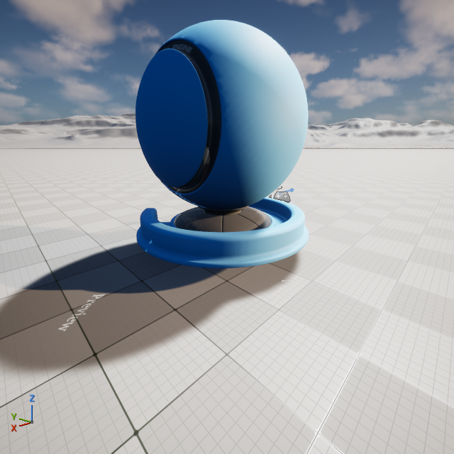

抛光黄铜典型

PBR 基础

磨砂塑料典型

PBR 基础

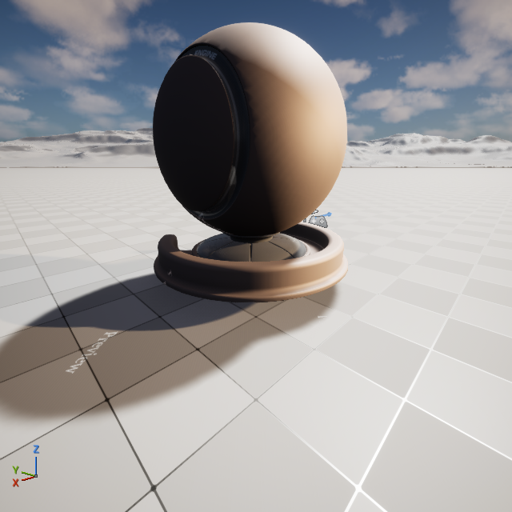

做旧锈铁边界

PBR 基础

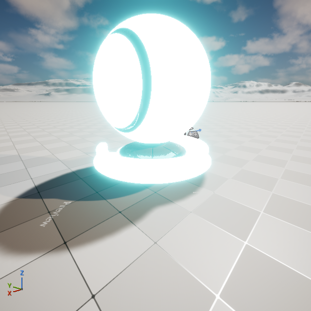

发光面板极端

PBR 基础

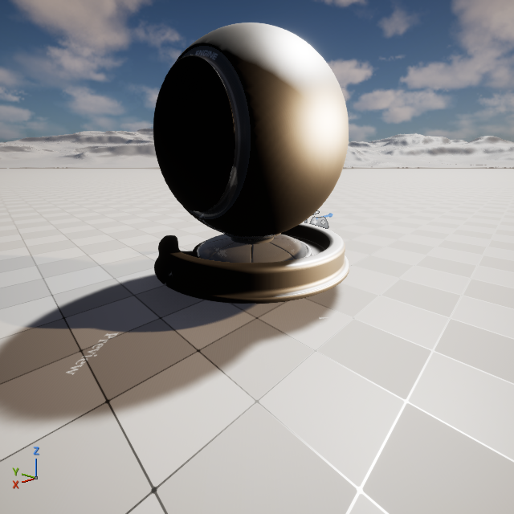

全默认灰边界

PBR 基础

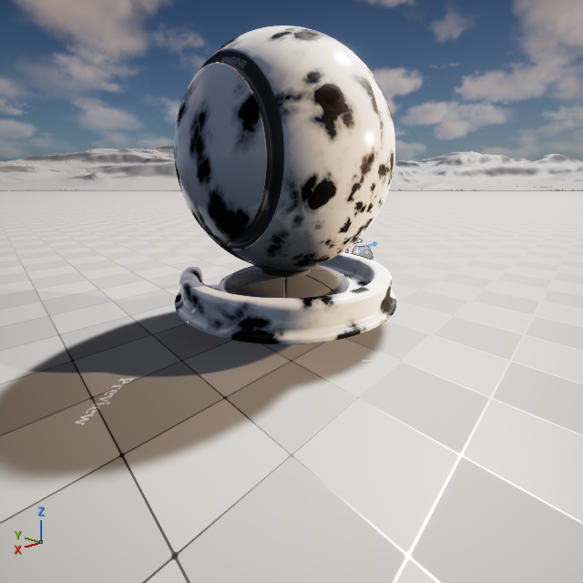

程序化大理石典型

程序化

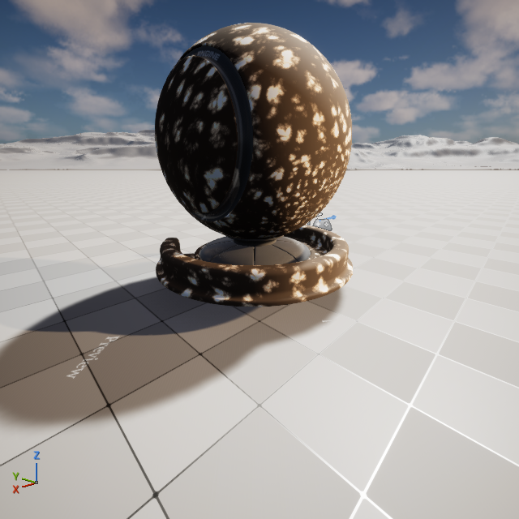

龟裂泥土典型

程序化

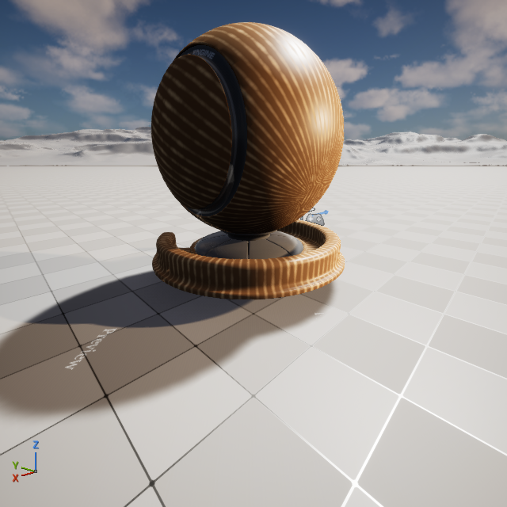

程序化木纹边界

程序化

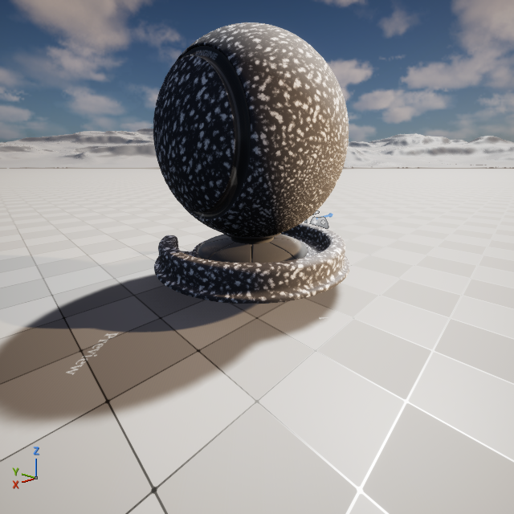

世界投影岩石极端

程序化

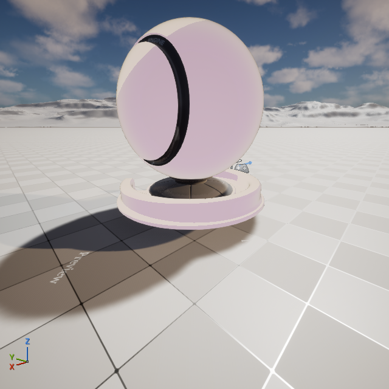

经典二档卡通典型

风格化

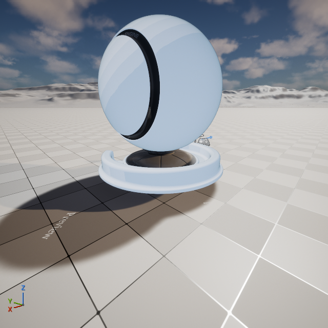

多档赛璐珞典型

风格化

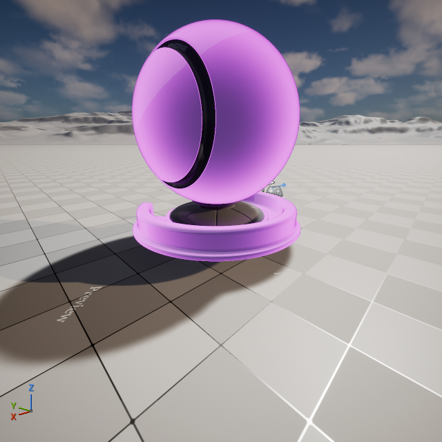

强边缘光英雄极端

风格化

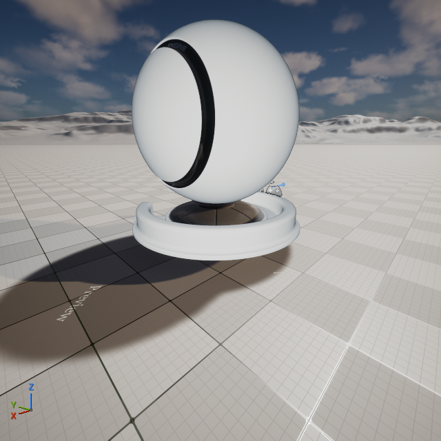

线稿描边极端

风格化

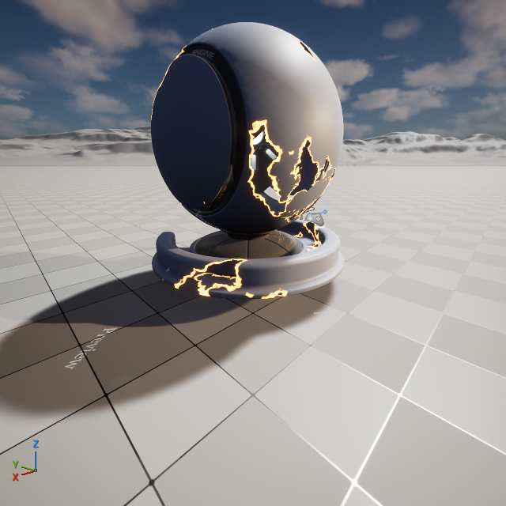

燃烧溶解典型

动态效果

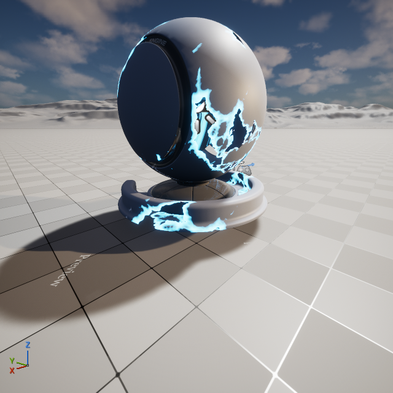

能量护盾典型

动态效果

全息扰动边界

动态效果

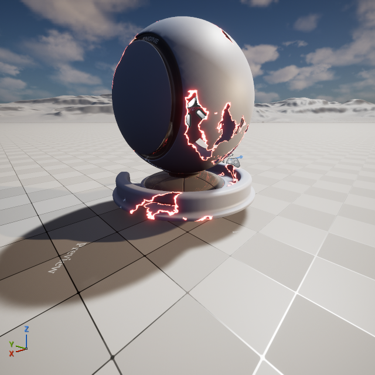

心跳核心极端

动态效果

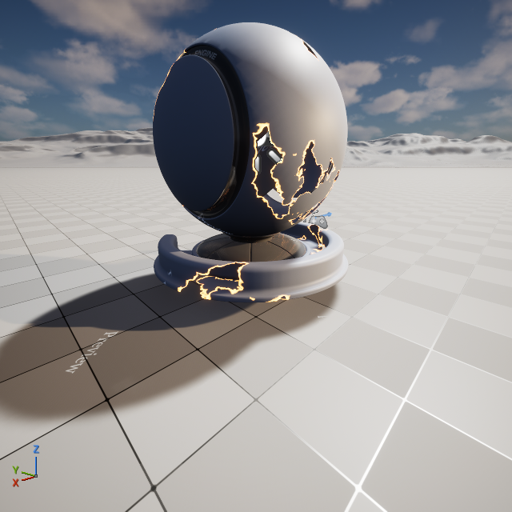

波动水面极端

动态效果

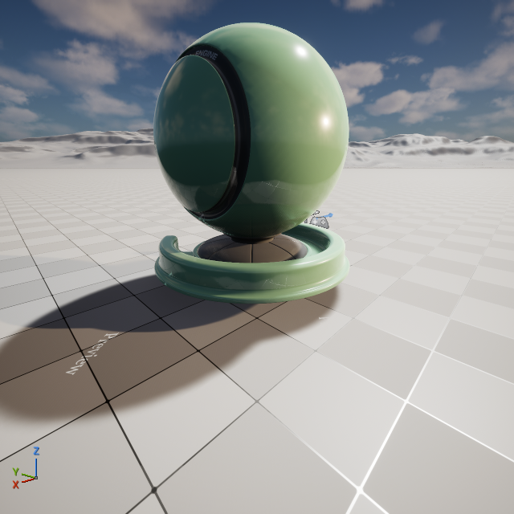

翡翠玉石极端

高级光照

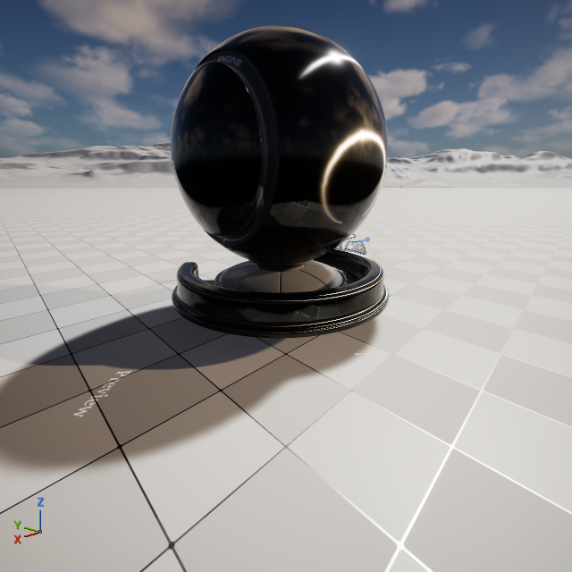

拉丝钛金属极端

高级光照

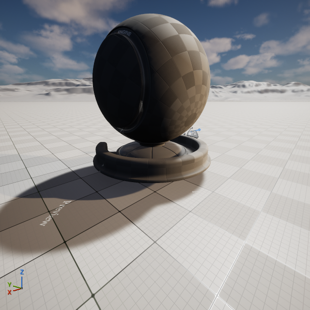

肥皂泡虹彩极端

高级光照

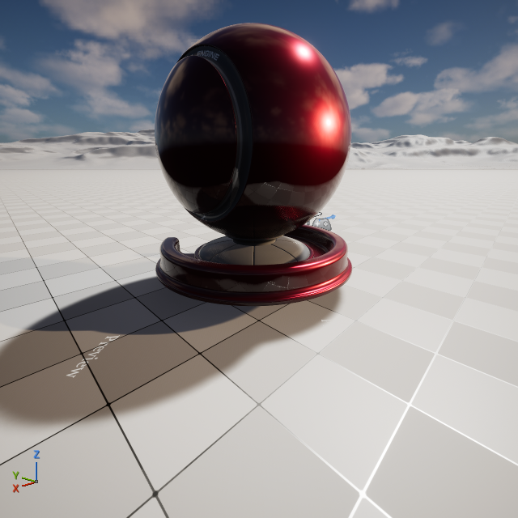

汽车金属漆典型

高级光照

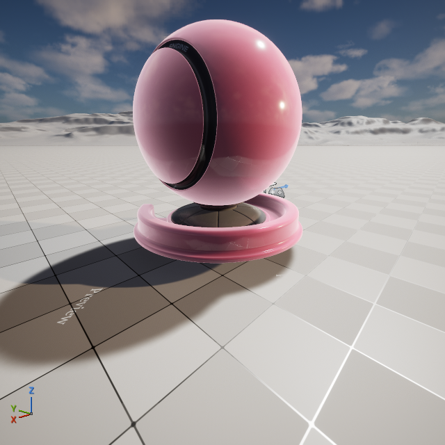

丝绒布料极端

高级光照

## 同父材质 · 不同子材质对比（UE 实拍）

三组并排对比，共享同一母材质，仅参数取值不同——这次差异是真机渲染出来的。

### 大理石 vs 木纹（程序化纹理类）

程序化大理石 典型

白底黑斑，低粗糙光泽

Noise Scale<b>3.0</b>

Stripe Amount<b>0.0（无条纹）</b>

Pattern Contrast<b>2.5</b>

Color A / B<b>浅 / 深</b>

Roughness Base<b>0.15</b>

程序化木纹 边界

暖色条带，沿 U 方向

Noise Scale<b>6.0</b>

Stripe Amount<b>0.7（强条纹）</b>

Stripe Frequency<b>35.0</b>

Color A / B<b>深棕 / 暖棕</b>

Roughness Base<b>0.4</b>

<b>关键变量：</b><code>Stripe Amount</code> 0→0.7 让纹理从各向同性斑块变成方向性条带，配合暖色双色渐变与更高的 Noise Scale，木质感成立；粗糙度 0.15→0.4 也让表面从抛光石材转为哑光木面。

### 多档赛璐珞 vs 线稿描边（风格化渲染类）

多档赛璐珞 典型

冷色多档过渡

Shade Bands<b>6 档</b>

Lit / Shadow<b>亮 / 暗</b>

Rim Power<b>6.0</b>

Outline<b>细（阈值 0.8）</b>

线稿描边 极端

近纯白平涂 + 粗黑边

Shade Bands<b>1 档（几乎无明暗）</b>

Lit / Shadow<b>白 / 近白</b>

Outline Width<b>0.4（粗）</b>

Outline Color<b>纯黑</b>

<b>层级差异：</b><code>Shade Bands</code> 6→1 是核心——6 档保留体积感，1 档几乎平涂；再把 <code>Outline Width</code> 放粗，整体从"赛璐珞角色"切到"漫画线稿"。这两张都是 Unlit 自定义光照在 UE 里实拍。

### 丝绒布料 vs 肥皂泡虹彩（高级光照类）

丝绒布料 极端

深红绒面，边缘泛光

Base Color<b>深红</b>

Roughness<b>0.8（漫反射）</b>

Cloth Amount<b>1.0</b>

Fuzz Color<b>粉绒边</b>

肥皂泡虹彩 极端

暗底镜面 + 虹彩薄膜

Base Color<b>近黑</b>

Roughness<b>0.05（镜面）</b>

Iridescence<b>开启 · Bands 6</b>

Clear Coat<b>1.0</b>

<b>光学对比：</b>丝绒高 <code>Roughness 0.8</code> + Fuzz 绒毛在掠射角泛光，质感"吸光"；肥皂泡 <code>Roughness 0.05</code> 近镜面 + 虹彩薄膜（Fresnel 相位差生成彩带）+ 清漆层，质感"反光 + 干涉"。同一 ClearCoat 母材质，两种相反的光学行为。

## 近似 vs 真实：这次补上了什么

| 维度 | 上一篇（程序化近似） | 本篇（UE 实拍） |
|---|---|---|
| 着色 | numpy 手写 Blinn-Phong | UE 物理 BRDF / 各 ShadingModel |
| 环境光照 | 单点方向光 | HDRI 天空 + 天光 + 大气 |
| 反射 / 投影 | 无 | 真实天空反射、地面投影 |
| 材质实例 | 仅参数→颜色映射 | 真实 MaterialInstanceConstant |
| 引擎一致性 | 与 UE 无关 | 即评测里声明的 UE 行为 |

**结论：** 评测体系（5 类 / 23 实例 / 四维评分）保持不变，但渲染证据从"示意"升级为"真机"。需要复现的话，全部脚本（母材质重建 `build_eval_materials.py`、批量截图 `init_unreal.py`）都在评测工程里。

> 想看分类设计、子实例采样规则与四维量化评分的完整论述，请回看 [上一篇评测正文](../ue-material-complexity-eval/)——本篇专注于"把图换成真的"。
