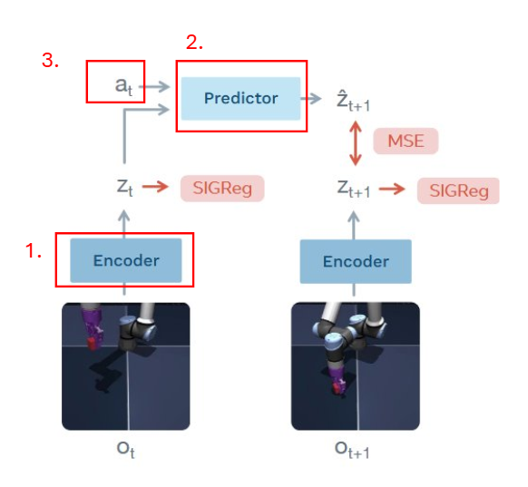

# LeWorldModel 阅读笔记：让 latent space 更适合规划

最近读到 LeWorldModel，也就是 LeWM。它讨论的是一个很典型但又很棘手的问题：如果世界模型不是直接在像素空间里预测未来，而是在 latent space 里预测，那么这个 latent space 应该长成什么样，才真的适合 planning？

JEPA 类方法的直觉是很漂亮的：不要强迫模型复原所有底层细节，而是学习一个更抽象、更稳定的表征，然后在这个表征空间里预测未来。这样做尤其适合那些观测里包含大量无关、不可预测细节的场景。比如颜色、纹理、光照、背景噪声可能变化很多，但真正对任务有用的是物体位置、速度、接触关系和目标状态。

## 为什么 latent space 很重要

一个可用于 world modelling 的 embedding 至少要满足三件事。

第一，它要有一致性和可预测性。相近的物理状态不应该被编码到完全无关的位置，否则 predictor 很难学习状态转移。

第二，它的结构要支持规划。planner 实际上是在问：如果我从当前状态出发，执行一串动作，未来会走到哪里？这要求 predictor 在动作条件下能生成平滑、合理的 latent 轨迹。

第三，它不能坍缩。所有状态如果都被 encoder 压成同一个点，prediction loss 可能在形式上变小，但这个 latent space 已经没有可用于决策的信息了。

传统上，避免 representation collapse 常见有两条路：一种是 EMA 这类训练技巧，另一种是信息最大化或对比学习方法。但前者更像工程经验，后者往往需要负样本、大 batch、多个 loss 项和不少超参数调节。LeWM 的核心选择更直接：约束整个 embedding 空间的几何形状。

## LeWM 的核心想法

LeWM 想避免 latent collapse 的方式，是让 latent embeddings 的整体分布接近各向同性高斯分布。换句话说，它不只是要求某个样本预测得准，也要求一批 latent 在空间里足够分散、方向上不要退化。

它的 loss 主要由两部分构成：

1. prediction loss：用 MSE 约束 predictor 预测出来的未来 latent 和目标 latent 接近。
2. SIGReg：Sketched-Isotropic-Gaussian Regularizer，用来约束 latent space 的整体分布。

SIGReg 的做法可以理解成：把一批 latent embeddings 沿很多随机方向投影成一维分布，然后惩罚这些一维分布与标准高斯之间的差异。这样一来，模型很难把所有 latent 都压到一个点上，因为坍缩后的投影分布显然不会像标准高斯。

这个设计让我觉得有意思的地方在于，它把“不要坍缩”从一个间接效果变成了一个更明确的几何约束。它没有引入重建像素的压力，也没有依赖负样本对比，而是直接要求 latent cloud 本身保持可用的形状。

## SIGReg 可能的问题

SIGReg 也不是免费的午餐。它依赖 batch 里的 latent 分布来估计整体几何结构，所以 batch 太小的时候，Epps-Pulley normality statistic 可能会很 noisy，进而给 encoder 传回不稳定的梯度。

另一个风险是 batch 采样偏差。如果一个 batch 里的轨迹高度相似，例如都来自同一类场景或物体位置非常接近，那么这个 batch 的 latent 分布本身就不能代表完整数据分布。此时强行把它推向 isotropic Gaussian，可能会把偏差也学进去。

还有一种情况更微妙：简单、低维、低多样性的环境不一定适合被强行高斯化。论文在 Two-Room 这样的环境里就提到，数据 manifold 本身可能维度很低，过强的高维高斯约束反而可能让 representation 变得不够结构化。也就是说，SIGReg 的目标不是“永远完美匹配高斯”，而是在复杂任务中给 latent space 一个防坍缩、可规划的形状先验。

## 在 latent space 里做 planning

LeWM 的 planning 过程建立在 latent rollout 上。给定当前 latent 和一串候选动作，predictor 会一步一步预测未来 latent 状态。于是 planner 不需要在像素空间里模拟未来，只需要在更紧凑的隐空间里比较不同动作序列的结果。

论文里使用 Cross-Entropy Method 来优化 action sequence。大致流程是：先假设动作序列来自一个分布，比如高斯分布；从中采样很多条候选序列；用 world model rollout 每一条序列；计算 cost；选出 cost 最低的一小部分 elite sequences；再用这些 elite sequences 更新采样分布。重复多轮后，选择当前最优的动作序列。

这通常还会配合 MPC，也就是 Model Predictive Control。每次规划一段未来动作，但只执行前几步；执行后重新观察环境，再重新规划。这样可以减少模型 rollout 误差累积带来的风险。

## 实验观察

实验任务包括四个 manipulation / control 场景。

对比方法包括 DINO-WM、PLDM、GCBC、GCIQL / GCIVL 和 Random。这里最重要的问题不是 LeWM 能不能学到一个“看起来不错”的 representation，而是这个 representation 能不能真的转化成 planning 能力。

从结果看，LeWM 的 compact latent space 不只是表示学习层面的概念优势，它直接带来了 planning 速度优势。因为搜索发生在更规整、更低噪声的 latent space 里，planner 可以更快评估候选动作序列。

另一个值得注意的点是训练稳定性。

LeWM 的卖点不只是最终分数，而是训练过程更简单、更可控、更容易复现。相比需要复杂负样本设计或多项 loss 平衡的方法，SIGReg 提供了一种更直接的防坍缩约束。

## latent space 到底学到了什么

我最关心的问题是：LeWM 的 latent space 是否真的编码了物理状态和物理规律？论文用了几种方式来检查。

第一是 probing physical quantities。冻结 LeWM 的 latent representation，再训练一个简单 probe，看能不能从 latent 里读出真实物理量。结果说明，即使没有预训练 encoder，端到端 latent dynamics training 仍然可以学到 task-relevant physical variables。

第二是 decoding latent space。研究者训练一个额外 decoder，从单个 latent embedding 重建 pixel observation。需要注意的是，这个 decoder 不是 LeWM 训练时的一部分，LeWM 本身没有 reconstruction loss。decoder 只是事后检查 latent 中保留了多少可恢复信息。训练早期重建图像比较模糊，后期逐渐能恢复场景结构。这说明 latent 中包含 scene structure，但不意味着 LeWM 是生成模型，也不意味着 latent 保留了所有像素细节。

第三是可视化 latent space。用 t-SNE 观察 Push-T latent 后，物理上相近的状态在 latent space 中也倾向于相近。

第四是 temporal latent path straightening。论文测量连续 latent velocity vectors 的 cosine similarity，发现 LeWM 学到的 latent dynamics 更规整，未来状态变化路径更直、更可预测。这对 planning 很关键，因为 planner 喜欢可预测的状态转移。

最后是 violation-of-expectation framework。如果发生违反物理连续性的事件，LeWM 的 latent dynamics 会表现出 surprise。这个观察说明，它关注的不只是颜色或外观变化，而是状态变化是否符合学到的物理规律。

## Takeaways

我对 LeWM 的理解可以压缩成一句话：它不是试图让 latent 表征“包含一切”，而是让 latent space 对预测和规划足够友好。

这也是它和很多视觉表征学习方法不太一样的地方。对 world model 来说，好的 representation 不只是分类、检索或重建意义上的好，而是要能让动作条件下的未来变得可预测、可搜索、可优化。SIGReg 的价值就在于，它给这个目标加了一个简洁的几何约束：别坍缩，别太乱，保持一个能支撑 rollout 和 planning 的空间。

当然，SIGReg 也有适用边界。batch 估计、采样偏差、低维环境中的过强高斯约束，都可能影响效果。但作为一种端到端 JEPA-based world model 的正则化思路，它提供了一个很有启发性的方向：与其在像素世界里追逐所有细节，不如在 latent 世界里塑造一个更适合行动的几何结构。

