# UE 材质评测·展示场景与多光照版：23 个材质 × 4 种光照 + 完整可还原 JSON

前两篇（[复杂度评测](../ue-material-complexity-eval/)、[真机渲染版](../ue-material-eval-real-render/)）解决了"材质设计得怎么样"和"在 UE 里真的渲出来"。这一篇解决两件新事：**①** 之前的展示场景只有单一光照，看不出材质在不同照明下的差异——所以重搭了一个**多光照对比场景**，23 个材质实例各自在 4 种光照下渲一遍；**②** 把全部材质蓝图导出成**完整、可重新导入还原的 JSON**。

<!--more-->

> 沿用前作的 23 个材质实例与 5 个母材质，独立发布，旧版本均保留可访问。

## 四种光照条件

为了对比同一材质在不同照明下的表现，场景配置了四个可独立开关的光照模式（预览物为 UE 自带材质球，统一相机与构图）：

☀️

方向光 Directional

暖白主光 + 弱天光，模拟日光，带清晰投影与天空反射

💡

点光源 Point

单点暖光从侧上方照射，近距离衰减，强调高光位置

🔦

聚光灯 Spot

冷白锥形光，地面投出光斑，突出材质受光/背光反差

🌅

HDR 环境光

天空大气 + 实时捕获天光为主，柔和全向照明，看整体固有色

## 多光照对比：典型材质

下面挑几个代表性材质，把它在四种光照下的渲染并排放，差异一目了然。

### 抛光黄铜（金属·高反射）

金属对光照最敏感——方向光下整个镜面映出天空，聚光灯下变成一颗暖色硬高光，点光源给出局部反射，HDR 下则是柔和的全向金属光泽。

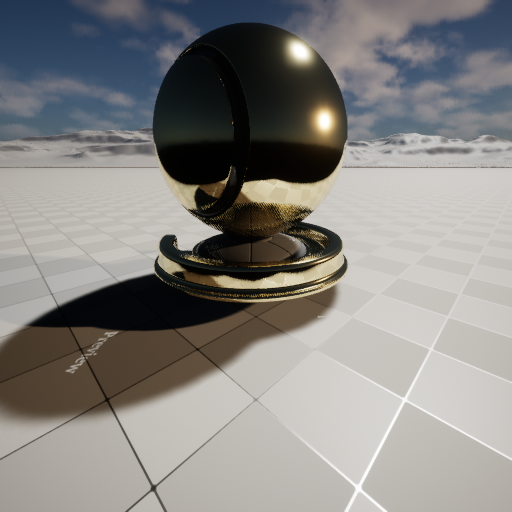
方向光

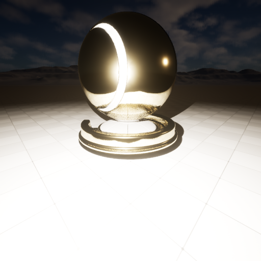
点光源

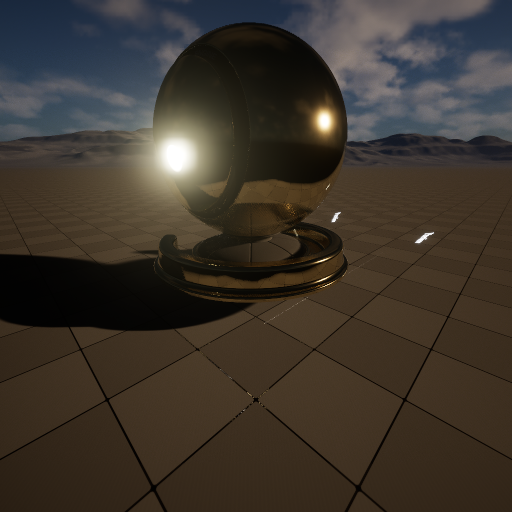
聚光灯

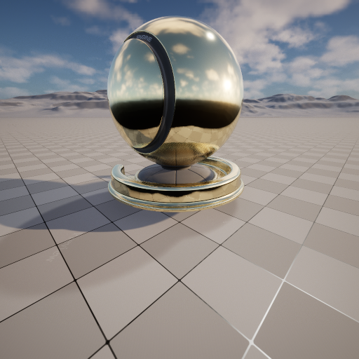
HDR 环境光

### 翡翠玉石（次表面散射）

SSS 材质在强方向光/聚光下透光感最明显（光从背面渗透），HDR 柔光下则呈现温润的整体散射。

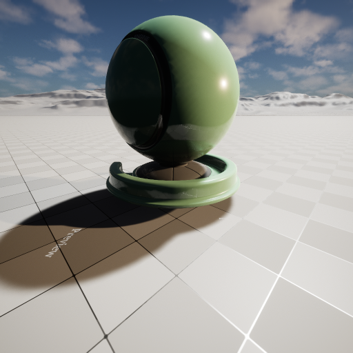
方向光

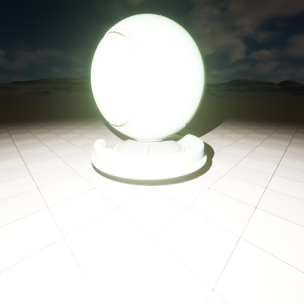
点光源

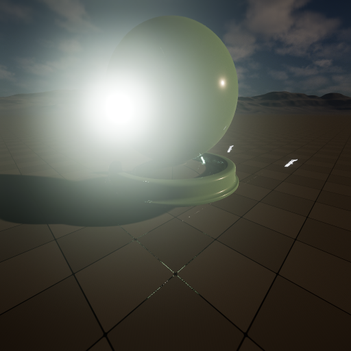
聚光灯

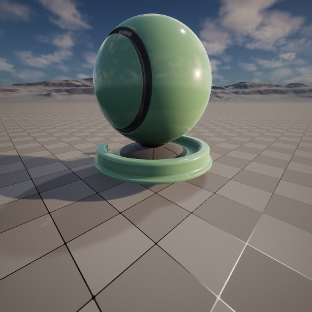
HDR 环境光

### 肥皂泡虹彩（薄膜干涉）

虹彩是视角 + 光照双重依赖。不同光照方向会让彩虹带出现在球面不同位置。

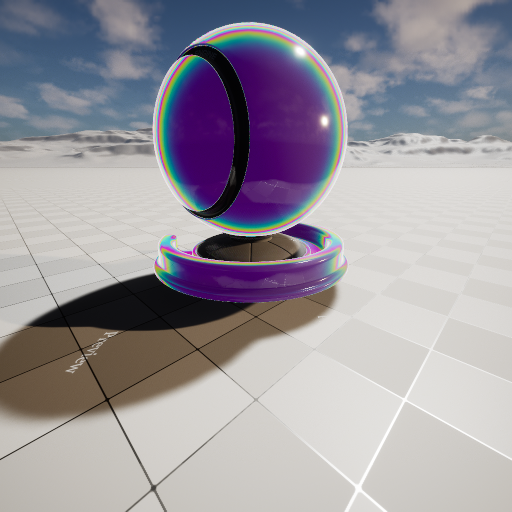
方向光

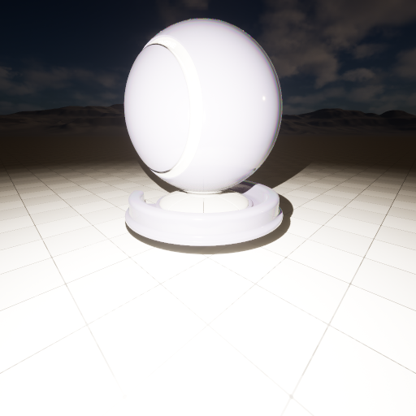
点光源

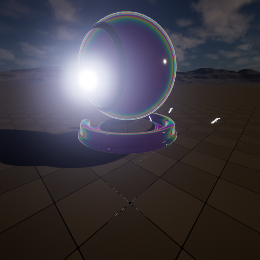
聚光灯

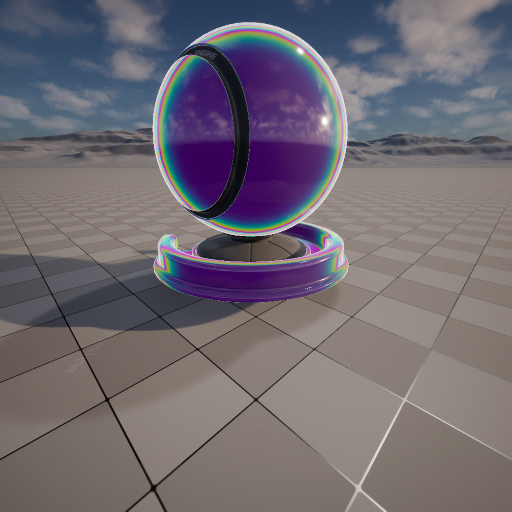
HDR 环境光

### 拉丝钛金属（各向异性）

各向异性高光沿切线方向被拉成条带，在方向光与聚光下的拉伸高光最为清晰。

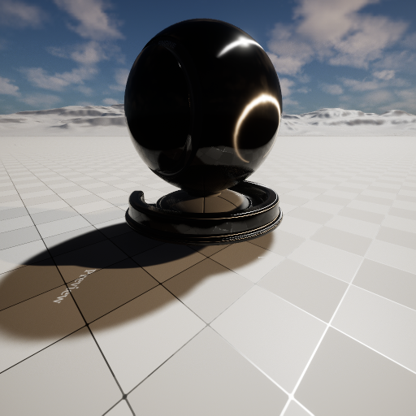
方向光

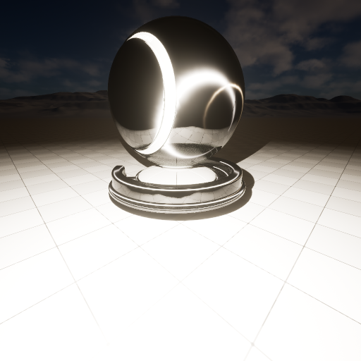
点光源

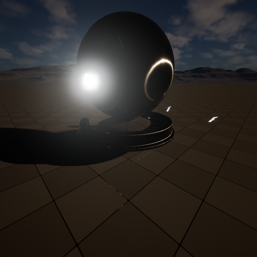
聚光灯

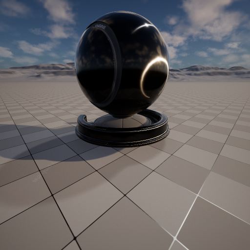
HDR 环境光

### 丝绒布料（Cloth 绒面）

布料是漫反射主导，对光照方向不如金属敏感，但掠射角的绒毛泛光（Fuzz）在侧向点光/聚光下更突出。

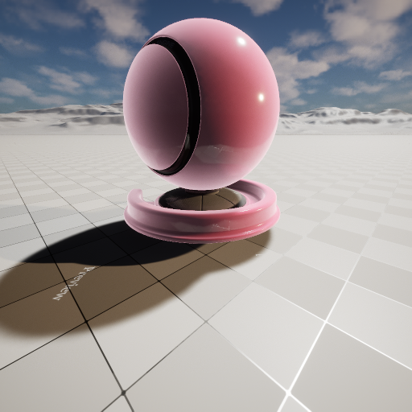
方向光

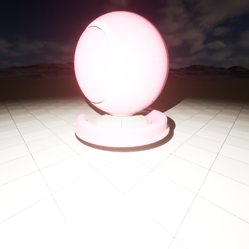
点光源

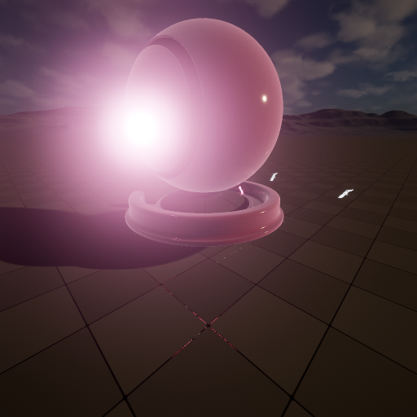
聚光灯

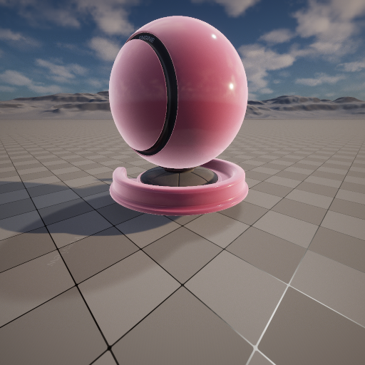
HDR 环境光

### 程序化大理石（纯数学纹理）

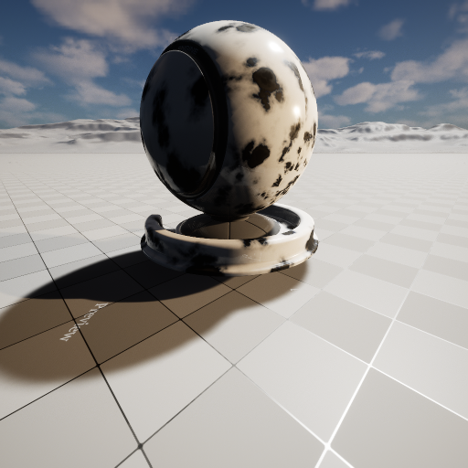
方向光

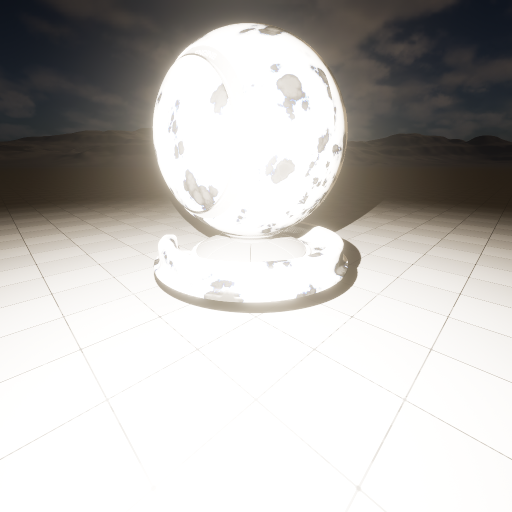
点光源

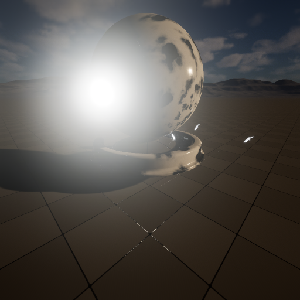
聚光灯

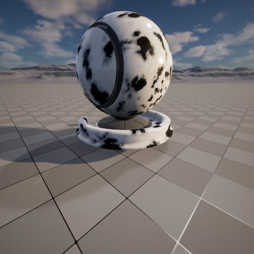
HDR 环境光

> 全部 23 个实例 × 4 光照 = **92 张** UE 实拍都在文章资源里（`img/<ref>__<directional|point|spot|hdri>.png`），上面只展示了代表性几组。

## 完整可还原的材质蓝图 JSON

第二个目标：把所有 UE 材质蓝图导出成结构化 JSON，且**字段完整到能重新导入还原**。导出脚本直接读取活动 UE 资产，覆盖：

<b>节点连接关系图</b>　nodes[] + connections[]（from_node.from_pin → to_node.to_pin，带 data_type）

<b>主材质输出引脚</b>　output_connections_runtime（从 UE 反查 BaseColor/Metallic/Roughness… 的来源节点）

<b>标量/向量/纹理/开关参数</b>　exposed_parameters[]（param_type + default + group + semantic + range）

<b>纹理引用路径</b>　referenced_textures[]（资产路径，程序化材质为空）

<b>实例覆写值</b>　instances[].overrides（scalar/vector/texture/static_switch 四类，逐项 name+value）

<b>材质元信息</b>　shading_model / blend_mode / two_sided / num_expressions

### 母材质片段（真实导出）

以高级光照母材质为例（已节选）：

<pre><code>{
  "material_id": "M_AdvLighting_Master",
  "shading_model": "MSM_CLEAR_COAT",
  "blend_mode": "BLEND_OPAQUE",
  "nodes": [
    { "node_id": "n_basecolor", "type": "VectorParameter", "label": "Base Color", "depth": 2 },
    ...
  ],
  "connections": [
    { "from_node": "n_sss_color", "from_pin": "RGB",
      "to_node": "n_sss_mul", "to_pin": "A", "data_type": "float3" },
    ...
  ],
  "exposed_parameters": [
    { "param_name": "Roughness", "param_type": "Scalar", "default": 0.3,
      "group": "01 - Base", "range": { "min": 0.0, "max": 1.0 } },
    { "param_name": "Subsurface Color", "param_type": "Vector",
      "default": [0.8, 0.25, 0.15, 1.0], "group": "02 - Subsurface" },
    { "param_name": "Enable Iridescence", "param_type": "StaticSwitch",
      "default": false, "group": "04 - Iridescence" }
  ]
}</code></pre>

### 实例覆写片段（真实导出·肥皂泡）

实例只存对父材质暴露参数的覆写——这正对应 UE 的 MaterialInstanceConstant：

<pre><code>{
  "instance_id": "MI_Adv_SoapBubble",
  "parent_material": "M_AdvLighting_Master",
  "overrides": {
    "scalar": [
      { "name": "Roughness", "value": 0.05 },
      { "name": "Iridescence Bands", "value": 6.0 },
      { "name": "Iridescence Intensity", "value": 2.5 },
      { "name": "Clear Coat", "value": 1.0 }
    ],
    "vector": [ { "name": "Base Color", "value": [0.05, 0.05, 0.08, 1.0] } ],
    "static_switch": [ { "name": "Enable Iridescence", "value": true } ]
  }
}</code></pre>
<a class="dl" href="data/material_blueprints.json" download>⬇ 下载完整 material_blueprints.json（5 母材质 + 23 实例）</a>

### 命名约定与分组

所有参数遵循统一约定：**分组用 `NN - 类别` 前缀**（如 `01 - Base`、`02 - Subsurface`、`04 - Iridescence`），保证材质实例面板里参数有序、可读；参数名采用 PascalCase 语义命名（`Roughness` / `Subsurface Color` / `Enable Iridescence`），母材质与实例覆写一一对应。

### 可还原性已验证

导出不是"只读快照"——我写了一个还原脚本，从 JSON 重建母材质节点与一个材质实例，在 UE 里重新编译通过，并读回 `Metallic = 1.0` 与导出值一致。也就是说这份 JSON 真的能往返（round-trip）。

## 小结

- **多光照对比场景**：方向光 / 点光 / 聚光 / HDR 四种条件，23 实例各渲一遍共 92 张，金属、SSS、虹彩、各向异性等对光照敏感的材质差异尤其明显。
- **完整 JSON 导出**：节点图 + 全参数 + 纹理路径 + 实例覆写，字段齐全、可重新导入还原，附下载。
- 沿用前作 23 实例与评测体系；前两篇（复杂度评测、真机渲染版）均保留。

> 工程脚本（母材质重建、多光照截图状态机、材质导出、还原校验）都在评测工程内，可复现。

